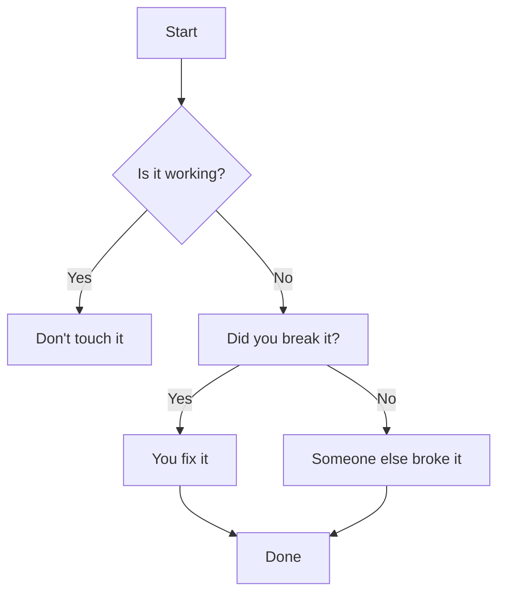

```mermaid
flowchart TD
    A[Start] --> B{Is it working?}
    B -- Yes --> C[Don't touch it]
    B -- No --> D[Did you break it?]
    D -- Yes --> E[You fix it]
    D -- No --> F[Someone else broke it]
    E --> G[Done]
    F --> G
```
